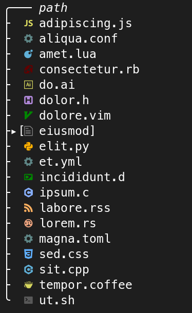

# xplr web-devicons reimplementation

<!--toc:start-->
- [xplr web-devicons reimplementation](#xplr-web-devicons-reimplementation)
  - [Requirements](#requirements)
  - [Installation](#installation)
    - [Install with xpm](#install-with-xpmxpm)
    - [Install manually](#install-manually)
  - [Features](#features)
  - [Overriding icon styles](#overriding-icon-styles)
<!--toc:end-->

A plugin for [xplr][xplr] that introduces all the
[nvim-web-devicons][nvim-web-devicons] with theming included.




## Requirements

- None!


## Installation

### Install with [xpm][xpm]

```lua
require("xpm").setup({
    'gitlab:hartan/web-devicons.xplr'
})
```

### Install manually

Follow the [instructions from the docs][xplr-install].


## Features

Direct conversion of the original [nvim-web-devicons][nvim-web-devicons]: Make
[xplr][xplr] look more like [nvim-tree][nvim-tree]!


## Overriding icon styles

Due to how the plugin is written, it is currently not possible to *only*
override the icon style while maintaining the icon itself (and vice versa).
You'll have to provide both the icon and the style in your config, like this:

```lua
xplr.config.node_types.extension["lua"].meta.icon = xplr.util.paint("", { fg = { Indexed = 74 }})
```

Refer to the [node types documentation][xplr-node-types] for additional
information.


[xplr]: https://xplr.dev/en/introduction
[xplr-install]: https://xplr.dev/en/installing-plugins
[xplr-node-types]: https://xplr.dev/en/node_types
[xplr-table-renderer]: https://xplr.dev/en/column-renderer
[nvim-web-devicons]: https://github.com/nvim-tree/nvim-web-devicons
[nvim-tree]: https://github.com/nvim-tree/nvim-tree.lua
[xpm]: https://github.com/dtomvan/xpm.xplr
